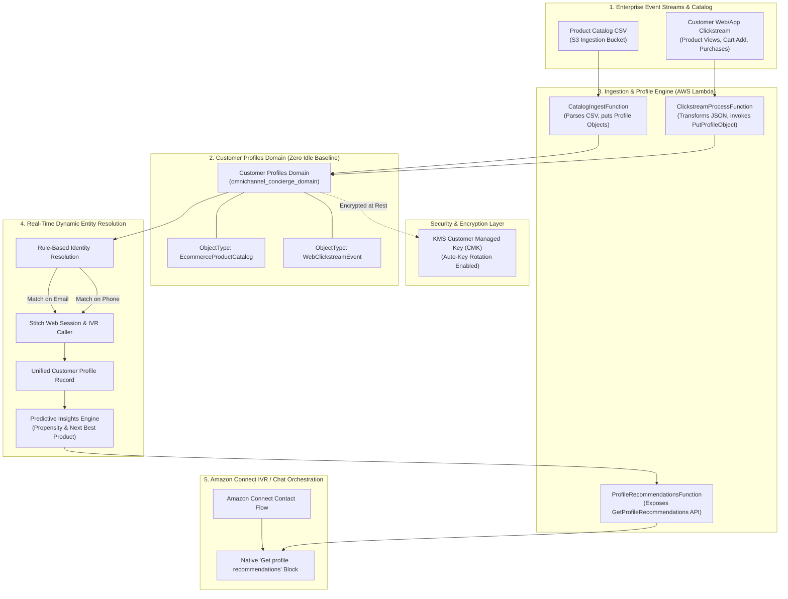

# Next-Gen Omnichannel E-Commerce AI Concierge

Welcome to the **Next-Gen Omnichannel E-Commerce AI Concierge** portfolio project. This enterprise-grade serverless demonstration implements a real-time, context-aware AI contact centre assistant on AWS using **Amazon Connect**, **Amazon Bedrock**, **Model Context Protocol (MCP)**, **Agent-to-Agent (A2A) Gateway**, and **Amazon Connect Customer Profiles**.

The system bridges web/mobile clickstream activity and inbound telephony IVR interactions, delivering personalised AI interactions while operating at **£0.00/month baseline idle cost**.

---

## 🌟 Core Features

1. **Voice-Native Telephony Latency (<800ms SLA)**: Uses native Amazon Connect Customer Profiles flow blocks (`Get profile recommendations`) rather than custom DynamoDB tables or API Gateway hops, keeping voice response frame latencies well under 800ms.
2. **Dynamic Real-Time Entity Resolution**: Automatically stitches disparate web clickstream sessions (`alex.dev@example.com`) and unlinked PSTN voice calls (`+15550199`) into a single unified customer profile.
3. **Zero-Idle-Cost Serverless Baseline**: Built 100% on pay-per-use AWS serverless primitives (Lambda, S3, Customer Profiles), incurring **£0.00/month** when inactive.
4. **Enterprise Encryption & IAM Controls**: KMS Customer Managed Keys (CMK) with 365-day key rotation protect all data at rest, coupled with least-privilege IAM scoping.
5. **Programmatic Test Harness**: Includes CDK stack assertion tests and Lambda unit test suites via `pytest` to guarantee IaC reliability and API contract validity.

---

## 🗺️ Project Architecture & Sprint Roadmap

This repository documents a 4-part production build for a Next-Gen Omnichannel E-Commerce AI Concierge:

| Part | Title & Focus | Key Tech Stack | Baseline Cost | Status |
| :--- | :--- | :--- | :--- | :--- |
| **Part 1** | [**Zero to AI-Ready: Data Readiness & Identity Resolution**](./blogs/part1_zero_to_ai_ready.md) *(Current Release)* | Customer Profiles, Dynamic Entity Resolution, AWS Lambda, S3, KMS CMK, CDK Python | **£0.00 / month (Idle)** | ✔️ **Completed** |
| **Part 2** | [**Agentic Tooling & Bedrock Guardrails**](./project_roadmap.md#%EF%B8%8F-part-2-agentic-tooling--mcp-integration-with-an-agentic-ide) | Model Context Protocol (MCP) Server, Bedrock Guardrails, PII Masking, Spec-Driven API Tooling | **£0.00 / month (Idle)** | 🟡 *Planned (Part 2)* |
| **Part 3** | [**Cross-Enterprise Collaboration: Serverless A2A Gateway**](./project_roadmap.md#-part-3-enterprise-agent-to-agent-a2a-serverless-gateway) | Amazon Connect Contact Flows, Bedrock Agent Core, Serverless A2A Gateway, EventBridge, Cognito | **£0.00 / month (Idle)** | 🟡 *Planned (Part 3)* |
| **Part 4** | [**Production Gatekeeping: Latency SLAs & Evals**](./project_roadmap.md#-part-4-pre-production-evaluation--latencyaccuracy-benchmarking) | Sub-800ms Telephony SLA Harness, Synthetic Contact Pipeline, Ragas Evals, CloudWatch Metrics | **£0.00 / month (Idle)** | 🟡 *Planned (Part 4)* |

For detailed implementation specifications for future releases, inspect [project_roadmap.md](./project_roadmap.md).

---

## 🏗️ System Architecture (Part 1 Data Engine)



For extended trade-off analysis and deep-dive architecture notes, see [architecture.md](./architecture.md).

---

## 📂 Project Directory Structure

```text
amazon-connect-concierge/
├── README.md                      # Primary project documentation and quick start
├── architecture.md                # System architecture, trade-offs, and design rationale
├── project_roadmap.md             # Detailed specs for Parts 2, 3, & 4 roadmap
├── cdk.json                       # AWS CDK CLI configuration
├── requirements.txt               # Python 3.12 dependencies
├── .env.example                   # Local environment variable template
├── blogs/                         # Publication-ready blog posts
│   └── part1_zero_to_ai_ready.md  # Part 1 technical deep-dive article
├── data/                          # Synthetic product catalog & clickstream event datasets
│   ├── catalog.csv                # Synthetic e-commerce product catalog
│   └── clickstream_events.json    # Real-time web/mobile customer clickstream events
├── infra/                         # AWS CDK Infrastructure as Code (Python)
│   ├── app.py                     # CDK application entrypoint
│   └── stacks/
│       ├── security_stack.py      # KMS Customer Managed Keys, IAM Roles & Policies
│       ├── storage_stack.py       # S3 Ingestion Buckets, Customer Profiles Domain & Mappings
│       └── compute_stack.py       # Data Ingestion Lambdas & Profile Recommendations API
├── scripts/                       # Helper & execution automation scripts
│   └── simulate_customer_journey.py # End-to-end customer journey simulator script
├── src/                           # Core application & Lambda logic
│   ├── lambdas/                   # Data ingestion, clickstream & profile recommendation handlers
│   │   ├── catalog_ingest.py      # Product catalog CSV parsing & ingestion
│   │   ├── clickstream_process.py # Web clickstream event transformer & identity merger
│   │   └── profile_recommendations.py # Predictive recommendations API handler
│   └── utils/                     # Service wrappers & payload parsing utilities
│       ├── boto3_helpers.py       # AWS SDK client initialisation helpers
│       └── profile_parser.py      # Profile payload normalization & propensity scoring
└── tests/                         # Automated testing harness
    ├── infra/                     # CDK stack assertion unit tests
    └── unit/                      # Pytest unit tests for Lambda functions and parsers
```

---

## ⚙️ Infrastructure as Code (AWS CDK Python)

The customer data domain and object mapping schema are declared using AWS CDK in Python:

```python
# StorageStack: Customer Profiles Domain & ObjectType Mappings
self.customer_profiles_domain = customerprofiles.CfnDomain(
    self,
    "ConciergeCustomerDomain",
    domain_name="omnichannel_concierge_domain",
    default_expiration_days=365,
    default_encryption_key=encryption_key.key_arn,
    matching=customerprofiles.CfnDomain.MatchingProperty(
        enabled=True,
        auto_merging=customerprofiles.CfnDomain.AutoMergingProperty(
            enabled=True,
            consolidation=customerprofiles.CfnDomain.ConsolidationProperty(
                matching_attributes_list=[["email"], ["phone"]]
            ),
            conflict_resolution=customerprofiles.CfnDomain.ConflictResolutionProperty(
                conflict_resolving_model="RECENCY"
            ),
        ),
        rule_based_matching=customerprofiles.CfnDomain.RuleBasedMatchingProperty(
            enabled=True,
            matching_rules=[
                customerprofiles.CfnDomain.MatchingRuleProperty(rule=["email"]),
                customerprofiles.CfnDomain.MatchingRuleProperty(rule=["phone"]),
            ],
            status="ACTIVE",
        ),
    ),
)
```

> [!TIP]
> **CloudFormation Discovery**: When defining `StandardIdentifiers` in `CfnObjectType` key mappings, CloudFormation validates strictly against CloudFormation schema enums (`["PROFILE"]`, `["UNIQUE"]`) rather than runtime SDK API strings (`EMAIL_ADDRESS` / `PHONE_NUMBER`).

---

## ⚙️ Quick Start Setup & Deployment

### Step 1: Initialize Local Environment
1. Navigate to this demo directory:
   ```bash
   cd amazon-connect-concierge
   ```
2. Create and activate a Python virtual environment:
   ```bash
   python -m venv .venv
   # On Windows PowerShell:
   .venv\Scripts\activate
   # On macOS/Linux:
   source .venv/bin/activate
   ```
3. Install dependencies:
   ```bash
   pip install -r requirements.txt
   ```
4. Copy the environment configuration template:
   ```bash
   Copy-Item .env.example .env  # PowerShell
   # or: cp .env.example .env   # Bash
   ```

### Step 2: Deploy AWS Infrastructure (CDK)
1. Ensure active AWS CLI session parameters (`AWS_PROFILE` and `AWS_DEFAULT_REGION` e.g. `eu-west-2`).
2. Synthesise and deploy the infrastructure stacks:
   ```bash
   cd infra
   cdk synth
   cdk deploy --all --require-approval never
   cd ..
   ```

### Step 3: Run Customer Journey Simulation
Execute the automated simulation script to upload the catalog CSV and stream real-time clickstream events:
```bash
python scripts/simulate_customer_journey.py
```

### Step 4: Verify Identity Resolution via AWS CLI
Search Customer Profiles to verify that email (`alex.dev@example.com`) and phone (`+15550199`) were automatically merged into a single unified record:
```bash
aws customer-profiles search-profiles \
  --domain-name omnichannel_concierge_domain \
  --key-name _email \
  --values "alex.dev@example.com" \
  --region eu-west-2
```

### Step 5: Test Profile Recommendations API
Invoke the profile recommendation handler locally or via AWS Lambda to generate GenAI prompt context:
```bash
python -m src.lambdas.profile_recommendations
```

---

## 🧪 Programmatic Testing

Run the automated test suite using `pytest`:

```bash
# Run infrastructure stack assertion tests
pytest tests/infra/

# Run Lambda unit & parser tests
pytest tests/unit/

# Run complete test suite with coverage
pytest --cov=src tests/
```

---

## 🔒 Security & Cost Architecture

* **£0.00 Baseline Cost**: Operates entirely on AWS serverless services (Customer Profiles, AWS Lambda, Amazon S3). Zero provisioned capacity or idle cluster costs.
* **KMS CMK Encryption**: Customer profiles and S3 buckets are encrypted using Customer Managed Keys with 365-day rotation.
* **Least-Privilege Roles**: IAM execution roles restrict access to explicit resource ARNs.

---

## 📄 Related Documentation & References

* 📖 [Part 1 Deep-Dive Blog Post](./blogs/part1_zero_to_ai_ready.md) — Comprehensive technical architecture article.
* 📐 [Architecture & Trade-Offs](./architecture.md) — Voice SLA latency analysis & Customer Profiles vs DynamoDB comparison.
* 🗺️ [Multi-Part Sprint Roadmap](./project_roadmap.md) — Architectural plans for Parts 2, 3, and 4.
