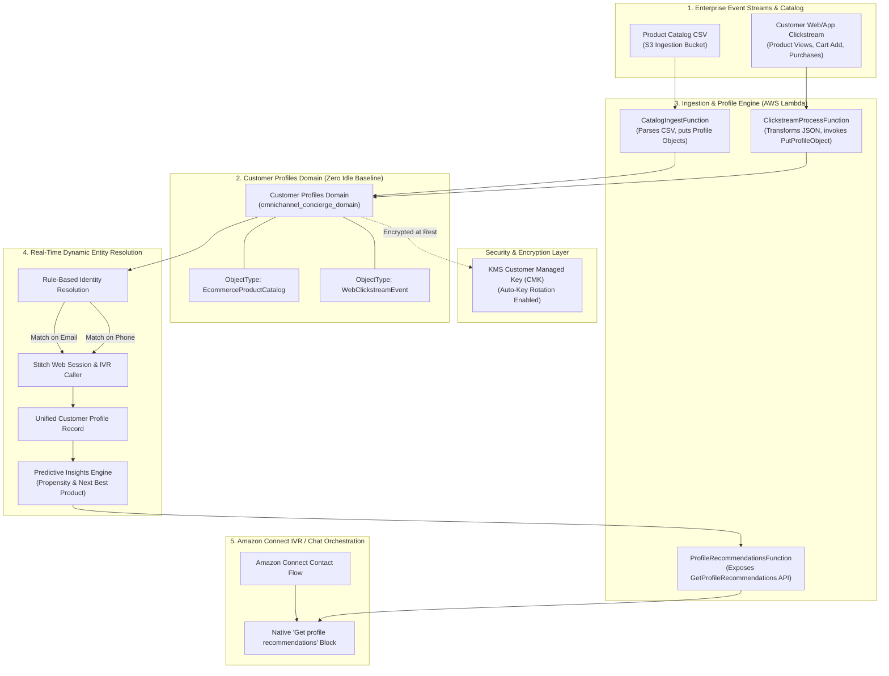

# Architecture & Design: Amazon Connect Omnichannel AI Concierge (Part 1)

This document provides the complete technical architecture, data pipeline specs, identity resolution logic, and design trade-offs for **Part 1: Customer Data Readiness & Predictive Personalization Pipeline** of the Next-Gen Omnichannel E-Commerce AI Concierge system.

---

## 1. System Architecture

Part 1 establishes the real-time customer data foundation required for GenAI contact center personalization.

---

## 2. Key Design Decisions & Architectural Trade-Offs

### A. Customer Profiles vs Custom Relational / NoSQL Database
* **Decision**: Ingest and stitch customer records directly into **Amazon Connect Customer Profiles** rather than building a custom DynamoDB or Amazon Aurora database.
* **Rationale**: 
  1. **Voice-Native Latency**: During a live IVR call, voice latency must stay under 800ms. Customer Profiles provides direct native flow block integration in Connect (`Get profile recommendations`), bypassing custom API gateway calls.
  2. **Automated Identity Resolution**: Stitches disparate identifier types (`email`, `phone`, `account_id`) dynamically without maintaining custom secondary index lookup tables.
* **Cost Impact**: Customer Profiles operates on a pay-per-profile and pay-per-ingestion API model. When inactive, baseline idle infrastructure costs remain at **$0.00 / month**.

### B. Dynamic Entity Resolution Matching Strategy
* **Rules-Based Matching**:
  * Rule 1: Match on exact `EmailHeader` (`StandardIdentifiers = ['PROFILE']`).
  * Rule 2: Match on exact `PhoneNumberHeader` (`StandardIdentifiers = ['PROFILE']`).
* **Conflict Resolution**: When an incoming event contains both a phone number and an email address, Customer Profiles evaluates both keys to merge duplicate profile records into a single `ProfileId`.

### C. Event Schema Specifications

#### 1. EcommerceProductCatalog ObjectType
* **Target Object Type**: `EcommerceProductCatalog`
* **Key Fields**: `SKU`, `ProductName`, `Category`, `Price`, `StockLevel`, `Brand`
* **Primary Key**: `SKU`

#### 2. WebClickstreamEvent ObjectType
* **Target Object Type**: `WebClickstreamEvent`
* **Key Fields**: `EventId`, `Timestamp`, `Email`, `Phone`, `EventType` (`view_product`, `add_to_cart`, `purchase`), `SKU`, `Category`
* **Matching Keys**: `Email` -> `PROFILE`, `Phone` -> `PROFILE`

---

## 3. Engineering Discoveries & CloudFormation Workarounds

### A. Customer Profiles ObjectType Standard Identifiers (`StandardIdentifiers`)
* **Discovery**: In CloudFormation's `AWS::CustomerProfiles::ObjectType` construct (`ObjectTypeKeyProperty`), `StandardIdentifiers` validates strictly against CloudFormation schema enum values (`PROFILE`, `UNIQUE`, `SECONDARY`, `DEVICE`, etc.) rather than runtime SDK API strings (`EMAIL_ADDRESS` / `PHONE_NUMBER`).
* **Workaround**: Configure `standard_identifiers=["PROFILE"]` inside CDK `CfnObjectType` key mappings.

### B. Customer Profiles AutoMerging Required Properties (`Consolidation`)
* **Discovery**: When enabling `AutoMerging` (`enabled=True`) on `CfnDomain.MatchingProperty`, the CloudFormation resource handler fails with `400 InvalidRequest` if `consolidation` is omitted.
* **Workaround**: Explicitly declare `consolidation=customerprofiles.CfnDomain.ConsolidationProperty(matching_attributes_list=[["email"], ["phone"]])` alongside `conflict_resolution`.

---

## 4. Demonstration & Verification Strategy

To verify Part 1 execution:

1. **Terminal Simulation**:
   Run `python scripts/simulate_customer_journey.py` to:
   * Upload synthetic product catalog (`data/catalog.csv`) to S3.
   * Send a sequence of real-time web clickstream events (`data/clickstream_events.json`) for a test user (`alex.dev@example.com` / `+15550199`).
2. **Customer Profiles Console Verification**:
   * Inspect the Amazon Connect Customer Profiles console to verify the **Unified Profile Record** showing stitched identity keys (`email` and `phone`) and mapped clickstream events.
3. **API Recommendation Payload Verification**:
   * Invoke `profile_recommendations.py` to view the JSON output payload containing calculated predictive recommendations ready for GenAI prompt insertion.
