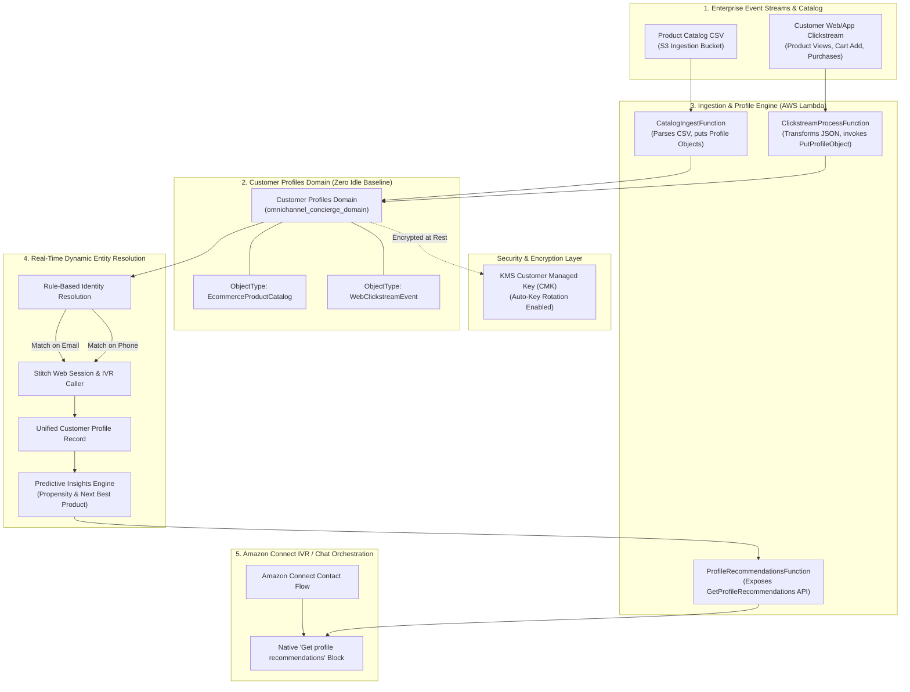

# Part 1: Zero to AI-Ready — Structuring Enterprise Data for Real-Time Personalisation in Amazon Connect

> **Series Index**:
> * **Part 1: Zero to AI-Ready — Structuring Enterprise Data for Real-Time Personalisation in Amazon Connect** *(You are here)*
> * Part 2: Accelerating Agentic Tooling — Building MCP Servers and Bedrock Guardrails with an Agentic IDE
> * Part 3: Cross-Enterprise Collaboration — Architecting a Serverless A2A Gateway for Amazon Connect Agents
> * Part 4: Production Gatekeeping — Latency Benchmarking and Automated Guardrail Evaluation for Connect AI

---

## Executive Summary & Background

Generative AI agents in modern contact centres live or die by the quality, freshness, and accessibility of customer data. When an enterprise customer calls or chats into an Amazon Connect instance, an LLM-driven voice/chat bot cannot deliver meaningful personalisation if customer purchase history, web clickstream activity, and profile identifiers are fragmented across isolated databases.

In this first instalment of our 4-part series on building a **Next-Gen Omnichannel E-Commerce AI Concierge**, we tackle **Customer Data Readiness**. We demonstrate how to configure **Amazon Connect Customer Profiles** with real-time dynamic entity resolution (deduplication across email and phone), ingest product catalogs and streaming clickstream events via AWS Lambda and S3, and expose the recommendation API (`ProfileRecommendationsFunction`) with zero baseline idle cost (**£0.00/month**).

*(Note: Part 1 focuses on building and deploying the backend data readiness foundation. In **Part 3**, we will provision the live Amazon Connect Instance and import the Contact Flow JSON definition that invokes this API directly in the IVR).*

---

## Architecture Overview

Part 1 implements a fully serverless, event-driven data readiness pipeline:



---

## Key Design Decisions & Architectural Rationale

### 1. Customer Profiles vs. Custom Relational / NoSQL Database
* **Decision**: Ingest and stitch customer records directly into **Amazon Connect Customer Profiles** rather than provisioning an Amazon DynamoDB table or Amazon Aurora database.
* **Rationale**: 
  * **Voice Latency Thresholds**: Live IVR audio frames require response latencies under 800ms. Amazon Connect Customer Profiles provides native Contact Flow block integration (`Get profile recommendations`), eliminating custom API gateway latency hops.
  * **Automatic Identity Stitching**: In real-world omnichannel customer journeys, a customer might browse products on a mobile app logged in via email (`alex.dev@example.com`), then call the IVR contact centre from an unlinked phone number (`+15550199`). Customer Profiles evaluates standard identity keys (`EMAIL_ADDRESS`, `PHONE_NUMBER`) to stitch these disparate events into a single unified record without requiring custom database index tables.
* **Cost Impact**: Customer Profiles uses a pay-per-profile model. When idle, the infrastructure baseline cost is **£0.00 / month**.

### 2. Encryption & Least-Privilege IAM Controls
* **KMS CMK Encryption**: All S3 ingestion buckets and Customer Profiles domain records are encrypted using a dedicated **AWS KMS Customer Managed Key (CMK)** with 365-day automatic key rotation enabled.
* **Decoupled CDK IAM Policies**: To prevent CloudFormation cyclic dependency deadlocks when linking Security, Storage, and Compute stacks, IAM policies are instantiated within consuming stacks and attached explicitly to role ARNs.

### 3. Operational Hygiene & Data Lifecycle Management
* **S3 Staging Lifecycle Expiration**: To maintain long-term cost controls and prevent raw catalog snapshots and transient clickstream JSON files from accumulating storage charges, the ingestion S3 bucket enforces a 30-day lifecycle expiration rule (`s3.LifecycleRule(expiration=Duration.days(30))`).
* **Log Retention & Observability**: Explicit 30-day log groups (`logs.LogGroup`) are configured across compute Lambdas to eliminate CloudWatch storage sprawl. Production deployments can incorporate **AWS Lambda Powertools for Python** to inject structured JSON logging and correlation IDs (`contact_id`) for distributed tracing.

---

## Infrastructure as Code (AWS CDK in Python)

Here is how the Customer Profiles Domain and `ObjectType` mappings are provisioned using the AWS CDK (Python 3.12+):

```python
# StorageStack: Customer Profiles Domain & ObjectType Mappings
self.customer_profiles_domain = customerprofiles.CfnDomain(
    self,
    "ConciergeCustomerDomain",
    domain_name="omnichannel_concierge_domain",
    default_expiration_days=365,
    default_encryption_key=encryption_key.key_arn,
    matching=customerprofiles.CfnDomain.MatchingProperty(
        enabled=True,
        auto_merging=customerprofiles.CfnDomain.AutoMergingProperty(
            enabled=True,
            conflict_resolution=customerprofiles.CfnDomain.ConflictResolutionProperty(
                conflict_resolving_model="RECENCY"
            )
        )
    )
)

# ObjectType Mapping: WebClickstreamEvent with Email & Phone Matching Keys
self.clickstream_object_type = customerprofiles.CfnObjectType(
    self,
    "ClickstreamObjectType",
    domain_name="omnichannel_concierge_domain",
    object_type_name="WebClickstreamEvent",
    allow_profile_creation=True,
    expiration_days=365,
    fields=[...],
    keys=[
        customerprofiles.CfnObjectType.KeyMapProperty(
            name="_email",
            object_type_key_list=[
                customerprofiles.CfnObjectType.ObjectTypeKeyProperty(
                    standard_identifiers=["PROFILE"],
                    field_names=["email"]
                )
            ]
        ),
        customerprofiles.CfnObjectType.KeyMapProperty(
            name="_phone",
            object_type_key_list=[
                customerprofiles.CfnObjectType.ObjectTypeKeyProperty(
                    standard_identifiers=["PROFILE"],
                    field_names=["phone"]
                )
            ]
        )
    ]
)
```

---

## Verifying the Data Pipeline

To verify the pipeline execution and inspect the live customer profile attributes:

### 1. Live API Attribute Verification (AWS CLI)
Because the out-of-the-box AWS Connect Admin Console UI only displays built-in standard identity fields and reserves custom attribute views for custom Agent Workspace panels, the raw predictive attributes (`LastViewedSKU`, `RecommendedCategory`, `PropensityScore`) attached to the profile record are queried via the Customer Profiles SDK API:

```bash
aws customer-profiles search-profiles --domain-name omnichannel_concierge_domain --key-name _email --values alex.dev@example.com --region eu-west-2
```


### 2. Customer Profiles Registered ObjectTypes (AWS Console)
Inside the Amazon Connect Admin Console (`Customer Profiles -> Data Mapping`), our custom schema definitions (`EcommerceProductCatalog` and `WebClickstreamEvent`) are registered in the domain:


### 3. Run the Local Journey Simulation Script
Execute the end-to-end journey simulation script inside `amazon-connect-concierge/`:

```bash
python scripts/simulate_customer_journey.py
```


### 4. Expected Output Payload (`GetProfileRecommendations`)
The simulation script ingests real-time clickstream events and outputs the prompt-ready recommendation context:

```json
{
  "statusCode": 200,
  "profile_id": "435a5d50e4674a418f7123297ff506f3",
  "last_viewed_sku": "SKU-SMART-201",
  "recommended_category": "Wearables",
  "propensity_score": "0.92",
  "prompt_context": "Customer is currently interested in Wearables (Recently viewed SKU: SKU-SMART-201). Offer a 10% discount bundle on matching accessories."
}
```

---

## Conclusion & What's Next in Part 2

In Part 1, we established an enterprise-grade customer data readiness foundation capable of dynamic identity resolution and real-time recommendation retrieval with zero idle cost.

In **Part 2**, we will build on this data foundation by leveraging an **Agentic IDE** (e.g. Antigravity) to implement **Agentic Tooling** via a custom **Model Context Protocol (MCP) server** and enforce strict **Amazon Bedrock Guardrails** for PII masking and hallucination control.

