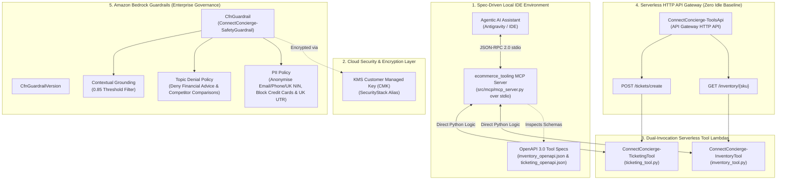

# Part 2: Accelerating Agentic Tooling — Building Spec-Driven MCP Servers and Amazon Bedrock Guardrails with an Agentic IDE

> **Series Index**:
> * Part 1: Zero to AI-Ready — Structuring Enterprise Data for Real-Time Personalisation in Amazon Connect
> * **Part 2: Accelerating Agentic Tooling — Building Spec-Driven MCP Servers and Amazon Bedrock Guardrails with an Agentic IDE** *(You are here)*
> * Part 3: Cross-Enterprise Collaboration — Architecting a Serverless A2A Gateway for Amazon Connect Agents
> * Part 4: Production Gatekeeping — Latency Benchmarking and Automated Guardrail Evaluation for Connect AI

---

## Executive Summary & Background

In modern generative AI customer service solutions, LLM agents require reliable real-time tools to execute actions—such as checking warehouse stock levels or creating customer support tickets—while maintaining strict enterprise security controls. However, constructing tool integrations manually across local IDE environments and production cloud runtimes often introduces schema drift, security vulnerabilities, and high latency overheads.

In this second instalment of our 4-part series on building a **Next-Gen Omnichannel E-Commerce AI Concierge**, we demonstrate a **Spec-Driven, MCP-Led Development Paradigm**. By defining tool contracts using the open **Model Context Protocol (MCP)** specification over `stdio` and OpenAPI 3.0 standards, an Agentic AI assistant (such as Antigravity) can seamlessly inspect tool capabilities, auto-generate production backend Lambda handlers, and provision zero-baseline infrastructure using AWS CDK.

Furthermore, we enforce enterprise safety and governance at the cloud boundary by deploying **Amazon Bedrock Guardrails** (`CfnGuardrail` & `CfnGuardrailVersion`) with automated PII anonymisation/blocking, sensitive topic denial filters, and a 0.85 contextual grounding threshold to eliminate hallucinations—all operating under a zero baseline idle cost model (**£0.00/month**).

---

## Architecture Overview

Part 2 introduces spec-driven local-to-cloud tooling orchestration:



---

## Key Design Decisions & Architectural Rationale

### 1. Spec-Driven MCP-Led Development Paradigm
* **Decision**: Establish tool schemas (`check_inventory` and `create_support_ticket`) first in MCP JSON-RPC contracts and OpenAPI specifications before writing Lambda implementations.
* **Rationale**: 
  * **Unified Local & Cloud Contract**: Developers and AI pairing assistants use the MCP server (`ecommerce_tooling`) locally via standard IO (`stdio`) for instant code execution, while production Amazon Connect and Amazon Bedrock Action Groups consume the exact same business logic over API Gateway HTTP APIs.
  * **Dual-Invocation Lambda Design**: Lambda handlers dynamically inspect incoming events to support standard API Gateway HTTP API payloads (`pathParameters`, `body`), Amazon Bedrock Action Group payloads (`actionGroup`, `parameters`, `requestBody`), and direct Python module imports (`get_inventory_status`, `create_support_ticket`).

### 2. Enterprise Safety Governance via Amazon Bedrock Guardrails
* **Decision**: Provision a dedicated `CfnGuardrail` and `CfnGuardrailVersion` in AWS CDK encrypted with our Customer Managed Key (CMK).
* **Rationale**:
  * **PII Protection & Compliance**: Customer contact flows must automatically strip or block sensitive personal identifiers before sending prompt contexts to foundation models. Email addresses, phone numbers, and UK National Insurance numbers (NIN) are automatically masked with `ANONYMIZE`, while financial data and tax identifiers (Credit/Debit Card numbers and UK Unique Taxpayer Reference numbers) trigger an immediate `BLOCK`.
  * **Topic Denial Filters**: Prevent the agent from delivering unauthorised financial advice or engaging in direct competitor comparisons.
  * **Hallucination Control**: A strict 0.85 `GROUNDING` threshold ensures responses are strictly grounded in retrieved inventory and profile data, while an 0.80 `RELEVANCE` threshold eliminates off-topic queries.

### 3. Serverless Cost-Control Baseline (£0.00 Idle Cost) & Abuse Mitigation
* **API Gateway HTTP APIs**: HTTP APIs are used in favour of standard REST APIs or Application Load Balancers, costing **approximately £0.80 per million requests** with **£0.00 baseline idle cost**.
* **Stage-Level Rate Limiting**: Standard pay-per-request serverless endpoints scale under load and can incur unexpected charges if spammed. By attaching stage-level throttling limits (**10 requests/second** and **burst limit of 20**) to the `$default` stage, excess traffic is rejected at the API Gateway edge with **`HTTP 429 Too Many Requests`**. This prevents unauthorised callers from invoking Lambda compute, ensuring baseline idle cost remains **£0.00/month** and financial exposure under attack is strictly capped.
* **Production API Authorisation**: In production enterprise environments, HTTP API routes can enforce `AWS_IAM` authorisation to ensure only authorised Amazon Bedrock Action Groups or Connect execution roles can invoke backend tool Lambdas.
* **AWS Lambda & Bedrock Guardrails**: Compute scales down to zero when inactive with explicit 30-day CloudWatch log retention.

---

## Infrastructure as Code (AWS CDK in Python)

Here is how the `ToolingStack` provisions the serverless HTTP API routes, stage rate limits, and Amazon Bedrock Guardrail using Python 3.12:

```python
# ToolingStack: API Gateway HTTP API & Amazon Bedrock Guardrail
class ToolingStack(Stack):

    def __init__(self, scope: Construct, construct_id: str, encryption_key: kms.IKey, lambda_role: iam.IRole, **kwargs) -> None:
        super().__init__(scope, construct_id, **kwargs)

        # 1. Lambda Tool Handlers
        self.inventory_fn = lambda_.Function(
            self, "InventoryToolFunction",
            function_name="ConnectConcierge-InventoryTool",
            runtime=lambda_.Runtime.PYTHON_3_12,
            handler="inventory_tool.handler",
            code=lambda_.Code.from_asset(LAMBDA_ASSET_DIR),
            role=lambda_role,
            timeout=Duration.seconds(10)
        )

        # 2. Serverless HTTP API Routes & Stage Rate-Limiting
        self.http_api = apigw2.HttpApi(
            self, "ConciergeToolsHttpApi",
            api_name="ConnectConcierge-ToolsApi",
            description="Serverless HTTP API for E-Commerce Inventory and Ticketing Tools"
        )
        
        # Enforce 10 req/sec rate limit & 20 burst limit at Gateway edge
        if self.http_api.default_stage and self.http_api.default_stage.node.default_child:
            cfn_stage: apigw2.CfnStage = self.http_api.default_stage.node.default_child
            cfn_stage.default_route_settings = apigw2.CfnStage.RouteSettingsProperty(
                throttling_rate_limit=10,
                throttling_burst_limit=20
            )

        self.http_api.add_routes(
            path="/inventory/{sku}",
            methods=[apigw2.HttpMethod.GET],
            integration=integrations.HttpLambdaIntegration("InventoryIntegration", self.inventory_fn)
        )

        # 3. Amazon Bedrock Guardrail Configuration
        self.guardrail = bedrock.CfnGuardrail(
            self, "ConciergeBedrockGuardrail",
            name="ConnectConcierge-SafetyGuardrail",
            kms_key_arn=encryption_key.key_arn,
            sensitive_information_policy_config=bedrock.CfnGuardrail.SensitiveInformationPolicyConfigProperty(
                pii_entities_config=[
                    bedrock.CfnGuardrail.PiiEntityConfigProperty(type="EMAIL", action="ANONYMIZE"),
                    bedrock.CfnGuardrail.PiiEntityConfigProperty(type="PHONE", action="ANONYMIZE"),
                    bedrock.CfnGuardrail.PiiEntityConfigProperty(type="UK_NATIONAL_INSURANCE_NUMBER", action="ANONYMIZE"),
                    bedrock.CfnGuardrail.PiiEntityConfigProperty(type="CREDIT_DEBIT_CARD_NUMBER", action="BLOCK"),
                    bedrock.CfnGuardrail.PiiEntityConfigProperty(type="UK_UNIQUE_TAXPAYER_REFERENCE_NUMBER", action="BLOCK")
                ]
            ),
            contextual_grounding_policy_config=bedrock.CfnGuardrail.ContextualGroundingPolicyConfigProperty(
                filters_config=[
                    bedrock.CfnGuardrail.ContextualGroundingFilterConfigProperty(type="GROUNDING", threshold=0.85),
                    bedrock.CfnGuardrail.ContextualGroundingFilterConfigProperty(type="RELEVANCE", threshold=0.80)
                ]
            )
        )

        self.guardrail_version = bedrock.CfnGuardrailVersion(
            self, "ConciergeBedrockGuardrailVersion",
            guardrail_identifier=self.guardrail.attr_guardrail_id,
            description="Production version v2 of Safety Guardrail"
        )
```

---

## Dual-Invocation Lambda Tool Logic

Below is the dual-invocation handler pattern implemented in `src/lambdas/inventory_tool.py`:

```python
def handler(event: Dict[str, Any], context: Any) -> Dict[str, Any]:
    """Handles both Bedrock Action Group events and API Gateway HTTP API requests with strict parameter validation."""
    
    # 1. Amazon Bedrock Action Group Payload Detection
    if "actionGroup" in event:
        sku = None
        for param in event.get("parameters", []):
            if param.get("name") == "sku":
                sku = param.get("value")
                break
                
        if not sku:
            return {
                "messageVersion": "1.0",
                "response": {
                    "actionGroup": event.get("actionGroup"),
                    "apiPath": event.get("apiPath"),
                    "httpMethod": event.get("httpMethod", "GET"),
                    "httpStatusCode": 400,
                    "responseBody": {"application/json": {"body": json.dumps({"error": "Missing required parameter 'sku'"})}}
                }
            }

        inventory_result = get_inventory_status(sku)
        return {
            "messageVersion": "1.0",
            "response": {
                "actionGroup": event.get("actionGroup"),
                "apiPath": event.get("apiPath"),
                "httpMethod": event.get("httpMethod", "GET"),
                "httpStatusCode": 200,
                "responseBody": {"application/json": {"body": json.dumps(inventory_result)}}
            }
        }

    # 2. Standard API Gateway HTTP API Request
    path_params = event.get("pathParameters") or {}
    sku = path_params.get("sku")
    
    if not sku:
        return {
            "statusCode": 400,
            "headers": {"Content-Type": "application/json"},
            "body": json.dumps({"error": "Missing required path parameter 'sku'"})
        }

    result = get_inventory_status(sku)
    return {
        "statusCode": 200,
        "headers": {"Content-Type": "application/json"},
        "body": json.dumps(result)
    }
```

---

## Testing & Verification

The solution is validated through comprehensive unit test suites (`tests/unit/test_tools.py`) and CDK infrastructure assertion tests (`tests/infra/test_tooling_stack.py`):

```bash
# Execute PyTest Verification Suite
.venv\Scripts\python.exe -m pytest tests/
```

### Execution Results:
```text
============================= test session starts =============================
platform win32 -- Python 3.13.5, pytest-9.1.1, pluggy-1.6.0
collected 22 items

tests\infra\test_cdk_stacks.py ...                                       [ 13%]
tests\infra\test_tooling_stack.py .                                      [ 18%]
tests\unit\test_ingestion.py ...                                         [ 31%]
tests\unit\test_tools.py ...............                                 [100%]

============================= 22 passed in 3.08s ==============================
```

```bash
# Synthesize AWS CDK Stacks
npx cdk synth
```
`npx cdk synth` outputs clean CloudFormation templates containing `AWS::ApiGatewayV2::Api`, `AWS::ApiGatewayV2::Route`, `AWS::Bedrock::Guardrail`, and `AWS::Bedrock::GuardrailVersion`.

---

## Conclusion & What's Next in Part 3

In Part 2, we built spec-driven tool Lambdas driven by MCP tool schemas and OpenAPI definitions, while securing foundation model interactions with enterprise-grade Amazon Bedrock Guardrails at zero baseline cost.

In **Part 3**, we will connect these tooling APIs and Customer Profiles recommendations directly into an **Amazon Connect Contact Flow**, provision a serverless **Agent-to-Agent (A2A) Gateway**, and enable multi-agent collaboration across enterprise boundaries.
