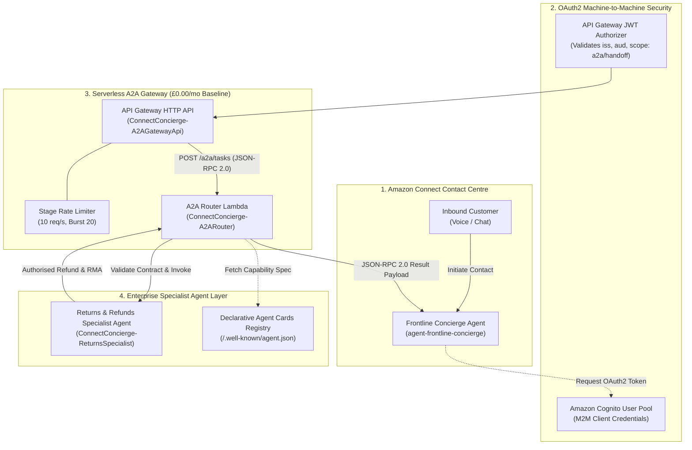

# Part 3: Cross-Enterprise Collaboration — Architecting a Serverless A2A Gateway for Amazon Connect Agents

Welcome to **Part 3** of our technical series on building a **Next-Gen Omnichannel E-Commerce AI Concierge** on AWS. 

In [Part 1](./part1_zero_to_ai_ready.md), we established an AI-ready customer data foundation using **Amazon Connect Customer Profiles** and dynamic entity resolution. In [Part 2](./part2_agentic_tooling_mcp_guardrails.md), we integrated legacy e-commerce APIs using the **Model Context Protocol (MCP)** and protected our model outputs with **Amazon Bedrock Guardrails**.

In this article, we solve one of the most pressing architectural challenges in enterprise AI: **Multi-Agent Collaboration**. We detail how to architect and deploy a decoupled, zero-baseline-cost **Agent-to-Agent (A2A) Serverless Gateway** on AWS strictly conforming to the published **Linux Foundation A2A Open Protocol v1.0 Specification** using **Amazon API Gateway**, **Amazon Cognito (OAuth2 Client Credentials)**, **AWS Lambda**, **JSON-RPC 2.0**, and **standardised Agent Cards**.

---

## 🏗️ System Architecture & Multi-Agent Mesh

In large enterprise environments, a single monolithic LLM prompt or agent cannot—and should not—handle every domain interaction. Frontline contact centre agents (like Amazon Connect IVR or chat flows) need to delegate specialised operations—such as calculating return valuations, issuing Return Merchandise Authorisations (RMAs), or processing refunds—to dedicated domain agents.



---

## 🌟 Key Technical Concepts

### 1. Declarative Agent Cards (`/.well-known/agent.json`)
Conforming to the published A2A Open Protocol v1.0 specification, **Agent Cards** are hosted at the standard URI `/.well-known/agent.json`. An Agent Card advertises an agent's:
* **Protocol Version** (`protocol_version: "1.0"`)
* **Provider Identity** (`provider`: Amazon Connect Concierge)
* **OAuth2 Security Requirements** (`authentication`: `client_credentials`, `scopes`)
* **Granular Skills & Capabilities** (e.g. `return_valuation`, `rma_generation`)
* **Service Endpoints** (`card_endpoint: "/.well-known/agent.json"`, `task_endpoint: "/a2a/tasks"`)

### 2. JSON-RPC 2.0 Task Execution Envelopes
Task execution uses **JSON-RPC 2.0** envelopes over HTTP (`method: "tasks/send"`):
* **Request Envelope**: Contains `jsonrpc: "2.0"`, `method: "tasks/send"`, `params` (task ID, session ID, profile, context snapshot), and correlation `id`.
* **Response Envelope**: Returns standard JSON-RPC 2.0 `result` or `error` structures.

### 3. Machine-to-Machine (M2M) OAuth2 Security Model
Cross-agent communication requires strict authentication. We use **Amazon Cognito User Pools** configured with an OAuth2 **Client Credentials** grant type.
* **Token Request**: The frontline agent exchanges its `client_id` and `client_secret` for a signed JWT access token.
* **Scope Validation**: The token carries custom resource server scopes (`a2a/handoff`).
* **Edge Validation**: API Gateway's native JWT Authorizer verifies token signatures and claims at the network boundary before invoking compute handlers.

### 3. Zero-Baseline Cost Architecture
By leveraging AWS serverless primitives, the entire A2A Gateway operates at a **£0.00/month baseline idle cost**:
* **Amazon Cognito**: M2M token generation incurs £0.00 idle cost.
* **Amazon API Gateway HTTP API**: Billed purely per million requests (£0.80/million).
* **AWS Lambda**: Billed per millisecond of execution time with scale-to-zero.

---

## ⚙️ Step-by-Step Code Walkthrough

### 1. Standardised A2A Handoff Contract (`a2a_handoff_contract.json`)

The handoff contract enforces a strict JSON schema for session state transitions:

```json
{
  "$schema": "http://json-schema.org/draft-07/schema#",
  "title": "A2AHandoffContract",
  "type": "object",
  "required": ["session_id", "origin_agent_id", "target_agent_id", "customer_profile", "context_snapshot"],
  "properties": {
    "session_id": { "type": "string" },
    "origin_agent_id": { "type": "string" },
    "target_agent_id": { "type": "string" },
    "customer_profile": {
      "type": "object",
      "required": ["profile_id", "email"],
      "properties": {
        "profile_id": { "type": "string" },
        "email": { "type": "string" }
      }
    },
    "context_snapshot": {
      "type": "object",
      "required": ["intent", "dialogue_summary"],
      "properties": {
        "intent": { "type": "string" },
        "dialogue_summary": { "type": "string" },
        "item_price_gbp": { "type": "number" },
        "fraud_risk_score": { "type": "number" }
      }
    }
  }
}
```

### 2. A2A Router Lambda Handler (`a2a_router.py`)

The A2A Router validates incoming contract payloads and routes requests to the target specialist agent:

```python
def handler(event, context):
    """API Gateway HTTP API Lambda handler for A2A Gateway Router."""
    http_method = event.get("requestContext", {}).get("http", {}).get("method", "GET")
    raw_path = event.get("rawPath", event.get("path", ""))

    # 1. Route: GET /a2a/agent-cards/{agent_id}
    if http_method == "GET" and "/a2a/agent-cards/" in raw_path:
        agent_id = raw_path.split("/a2a/agent-cards/")[-1].strip()
        card = load_agent_card(agent_id)
        return format_a2a_response(200, f"Agent card retrieved for '{agent_id}'", card)

    # 2. Route: POST /a2a/handoff
    if http_method == "POST" and raw_path.endswith("/a2a/handoff"):
        body_str = event.get("body", "")
        payload = json.loads(body_str)

        # Validate Handoff Contract
        valid, msg = validate_handoff_payload(payload)
        if not valid:
            return format_a2a_response(400, f"A2A Contract Violation: {msg}", {})

        # Invoke Specialist Agent Lambda
        specialist_fn = os.environ.get("RETURNS_SPECIALIST_FUNCTION_NAME")
        lambda_client = boto3.client("lambda")
        response = lambda_client.invoke(
            FunctionName=specialist_fn,
            InvocationType="RequestResponse",
            Payload=json.dumps(payload)
        )
        res_payload = json.loads(response["Payload"].read().decode("utf-8"))
        return format_a2a_response(200, "A2A Handoff executed successfully", res_payload)
```

---

## 📸 AWS Console & Evidence Screenshot Guide

When publishing this architecture blog post or demonstrating project completion, capture the following screenshots from the AWS Management Console and CLI:

| Asset ID | Description | AWS Console Navigation Path / Command |
| :--- | :--- | :--- |
| **Screenshot 1** | **Cognito User Pool App Client & Scopes** | **Amazon Cognito** > User Pools > `ConnectConcierge-A2AUserPool` > App Clients > `A2AMeshClient` (Highlighting `client_credentials` flow & `a2a/handoff` custom scope). |
| **Screenshot 2** | **API Gateway HTTP API Routes & JWT Authorizer** | **API Gateway** > `ConnectConcierge-A2AGatewayApi` > Authorization / Routes (Showing `POST /a2a/handoff` attached to `A2ACognitoAuthorizer`). |
| **Screenshot 3** | **CloudWatch Execution Logs** | **CloudWatch** > Log Groups > `/aws/lambda/ConnectConcierge-A2ARouter` (Showing structured log lines verifying verified claims and session handoff). |
| **Screenshot 4** | **Terminal CLI Simulation Run** | Terminal window executing `python scripts/simulate_a2a_handoff.py` showing OAuth2 token acquisition, card discovery, and £49.99 refund authorisation. |

---

## 🚀 Deployment Commands

Deploy the infrastructure stacks to AWS:

```bash
# Navigate to CDK directory
cd infra

# Synthesise CloudFormation templates
cdk synth

# Deploy all stacks to AWS
cdk deploy --all --require-approval never
cd ..
```

Execute the end-to-end A2A handoff simulation:

```bash
python scripts/simulate_a2a_handoff.py
```

---

## 📄 Next Up: Part 4

In **Part 4**, we will implement **Production Gatekeeping: Real-Time Latency Optimisation (<800ms SLAs) and Automated Ragas Guardrail Evaluation**.
