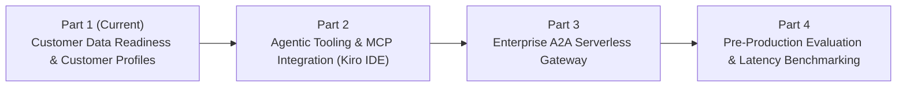

# Future Build Roadmap: Next-Gen Omnichannel E-Commerce AI Concierge

This document outlines the detailed specs, architecture, implementation plans, and blog post titles for future coding sessions across Parts 2, 3, and 4 of the **Next-Gen Omnichannel E-Commerce AI Concierge** series.

---

## 🚀 Overview of Future Sessions

---

## 🛠️ Part 2: Agentic Tooling & MCP Integration with an Agentic IDE

### **Blog Post Title**:
> *"Part 2: Accelerating Agentic Tooling — Building MCP Servers and Bedrock Guardrails with an Agentic IDE"*

### **Focus & Concepts**:
* Agentic Tooling & Spec-Driven Development using an **Agentic IDE** (e.g. Antigravity).
* Standardising legacy enterprise APIs (inventory, ticketing) using the **Model Context Protocol (MCP)**.
* Implementing Amazon Bedrock Guardrails for safety, PII redaction, and hallucination control.

### **What We Will Build**:
1. **Spec-Driven API Tooling**:
   * OpenAPI specs for Legacy E-Commerce Inventory (`GET /inventory/{sku}`) and Order Status/Returns (`POST /tickets/create`).
   * Serverless API Gateway + AWS Lambda backends.
2. **Custom Model Context Protocol (MCP) Server**:
   * Build a custom MCP server in Python (`mcp-server-ecommerce`) exposing standardised tool definitions to foundation models.
3. **Bedrock Guardrail Configuration**:
   * Provision a Bedrock Guardrail in CDK enforcing PII masking (email, phone, credit card), topic blocking, and contextual grounding thresholds.
4. **Amazon Connect Orchestration AI Agent**:
   * Integrate Bedrock foundation models (Claude 3.5 Sonnet / Sonnet) with Bedrock Agent tools and attach the custom guardrail.

---

## 🌐 Part 3: Enterprise Agent-to-Agent (A2A) Serverless Gateway

### **Blog Post Title**:
> *"Part 3: Cross-Enterprise Collaboration — Architecting a Serverless A2A Gateway for Amazon Connect Agents"*

### **Focus & Concepts**:
* Multi-Agent Mesh Architectures & Agent-to-Agent (A2A) Protocol.
* Decoupled specialised agents (Frontline Voice/Chat Agent vs Returns & Refunds Agent).
* Cognito Token Authentication and State Handoff.

### **What We Will Build**:
1. **Serverless A2A Gateway**:
   * Amazon API Gateway + AWS Step Functions orchestrator.
   * Amazon Cognito User Pool for OAuth2 client credentials token authentication.
2. **Two Specialised Agents**:
   * **Agent 1**: Frontline Voice/Chat Agent in Amazon Connect (handles triage, basic identity verification via Customer Profiles, and intent extraction).
   * **Agent 2**: External Returns & Refunds Specialist Agent (built on Bedrock Agent Core runtime, capable of calculating refund eligibility and issuing return labels).
3. **Agent Cards & State Contracts**:
   * Standardised JSON Agent Cards defining capabilities, input/output schemas, and state handoff protocols (`AgentCard.json`).
   * Seamless session handoff demonstrating voice/chat context persistence across agent transitions.

---

## 🧪 Part 4: Pre-Production Evaluation & Latency/Accuracy Benchmarking

### **Blog Post Title**:
> *"Part 4: Production Gatekeeping — Latency Benchmarking and Automated Guardrail Evaluation for Connect AI"*

### **Focus & Concepts**:
* Automated Pre-Production Gatekeeping & Field Readiness.
* Real-time Voice Latency Optimisation (<800ms response targets).
* LLM Accuracy Evaluation (Ragas / LLM-as-a-Judge).

### **What We Will Build**:
1. **Synthetic Contact Test Harness**:
   * Python test automation suite (`tests/benchmarks/test_harness.py`) feeding synthetic contact flows into Connect to simulate customer calls/chats.
2. **State Caching Layer**:
   * Amazon ElastiCache / DynamoDB session caching layer to maintain state across agent turns and minimize model roundtrips.
3. **Accuracy & Latency Metrics Dashboard**:
   * Automated benchmark script evaluating Intent Accuracy, Faithfulness, RAG Context Recall, and Turn Latency (TCP/UDP).
   * Operational dashboard in CloudWatch / OpenSearch capturing real-time metrics, tool failure rates, and estimated CSAT.

---

## 📌 Summary Table for Future Coding Sessions

| Session | Focus Area | Deliverables | Key Leadership Principle |
| :--- | :--- | :--- | :--- |
| **Session 2** | MCP & Bedrock Guardrails | Kiro Spec API, Custom MCP Server, Bedrock Guardrail CDK Stack, Part 2 Blog | **Invent and Simplify** |
| **Session 3** | Multi-Agent A2A Gateway | API Gateway Step Functions A2A Router, Cognito Token Auth, Agent Cards, Part 3 Blog | **Think Big** |
| **Session 4** | Latency & Accuracy Eval | Synthetic Test Harness, DynamoDB Caching Layer, Ragas Benchmark Suite, Part 4 Blog | **Insist on the Highest Standards** |
