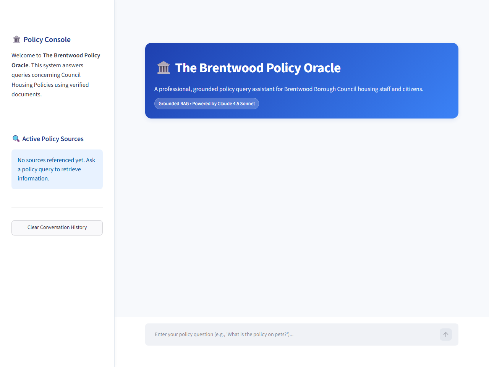
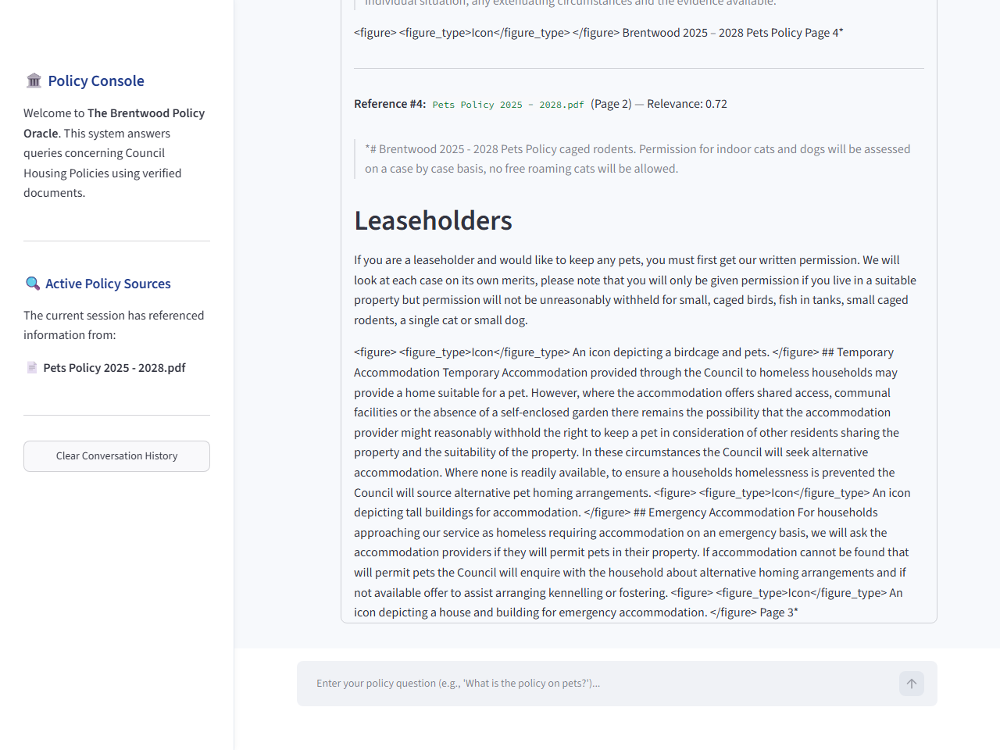

# The Brentwood Policy Oracle (Serverless RAG Demo)

The **Brentwood Policy Oracle** is a serverless, cost-optimized Retrieval-Augmented Generation (RAG) assistant designed for public housing policy queries. Built using **Amazon Bedrock Knowledge Bases**, it allows housing officers and UK citizens to get immediate answers to complex policy questions, accompanied by exact source PDF page citations.

This demo highlights how to handle unstructured public regulatory documents containing complex tables (like points-banding allocation matrices) and operate a RAG pipeline at **$0/month baseline idle cost**.

For a detailed breakdown of the technical decisions and security posture, see [architecture.md](./architecture.md).

---

## 🌟 Core Features

1.  **Tabular Structure Preservation**: Uses the Amazon Bedrock Foundation Model Parser (Claude 3 Sonnet) to translate multi-column regulatory tables into clean Markdown tables before vector ingestion.
2.  **Zero-Idle Compute Bills**: Leverages the new **Amazon S3 Vectors** storage backend, completely avoiding the ~$345/month baseline cost of Amazon OpenSearch Serverless (AOSS).
3.  **Strict Verification and Citations**: Features clickable references in the UI. If a query is not addressed in the downloaded policy library, the guardrails safely respond that the answer cannot be found.
4.  **Continuous Quality Evaluation**: Includes a Python evaluation pipeline using the **Ragas** framework to programmatically assess RAG accuracy (Faithfulness, Relevance, Recall) against a golden test set.

---

## 📂 Project Directory Structure

```text
bedrock-knowledge-base/
├── README.md                 # This file
├── architecture.md           # Deep-dive architecture and design decisions
├── requirements.txt          # Python dependencies
├── Dockerfile                # Streamlit app container definition (Sprint 3)
├── docker-compose.yaml       # Multi-container local orchestration (Sprint 3)
├── docs/                     # Documentation and ingestion PDFs
│   ├── brentwood-housing-policies/  # Raw PDF policies downloaded
│   ├── download_pdfs.py      # Script to scrape council policies
│   ├── project_briefing.md   # Project briefing parameters
│   ├── sprint1_outcomes.md   # Sprint 1 completion walkthrough
│   ├── sprint2_outcomes.md   # Sprint 2 completion walkthrough
│   ├── sprint3_outcomes.md   # Sprint 3 completion walkthrough
│   ├── sprint4_outcomes.md   # Sprint 4 completion walkthrough
│   └── video_script.md       # Presenter demo transcript
├── infra/                    # AWS CDK IaC (Python)
│   ├── app.py                # CDK entrypoint
│   └── knowledge_base_stack.py # Storage, KMS, IAM, and KB definitions
├── scripts/                  # Helper scripts
│   ├── bootstrap_ingestion.py # Script to upload policies and trigger KB sync
│   └── run_query.py          # Script to run policy queries via CLI
├── src/                      # Streamlit Application & Backend
│   ├── __init__.py           # Package init
│   ├── app.py                # Streamlit web application frontend (Sprint 3)
│   ├── citation_parser.py    # Citation extraction logic (Sprint 2)
│   ├── orchestrator.py       # RAG query orchestrator (Sprint 2)
│   └── static/               # Frontend asset and style directory
│       └── style.css         # Custom friendly light CSS styles (Sprint 3)
└── tests/                    # Verification suite
    ├── conftest.py           # Pytest configurations
    ├── eval_pipeline.py      # Ragas evaluation pipeline script (Sprint 4)
    ├── golden_set.json       # 20-question golden evaluation dataset (Sprint 4)
    ├── test_app.py           # Streamlit health integration tests (Sprint 3)
    ├── test_infra.py         # Infrastructure unit tests (Sprint 1)
    ├── test_orchestration.py # Orchestrator unit tests (Sprint 2)
    └── verify_ingestion.py   # Ingestion verification script (Sprint 1)
```

---

## ⚙️ Quick Start Setup

### Step 1: Initialize local environment
1. Navigate to this demo directory:
   ```bash
   cd bedrock-knowledge-base
   ```
2. Create a virtual environment and activate it:
   ```bash
   python -m venv .venv
   # Windows:
   .venv\Scripts\activate
   # macOS/Linux:
   source .venv/bin/activate
   ```
3. Install the dependencies:
   ```bash
   pip install -r requirements.txt
   ```
4. Create your local environment configuration by copying the template:
   ```bash
   cp .env.example .env
   # Or on Windows PowerShell:
   Copy-Item .env.example .env
   ```
   Open the `.env` file and set your `AWS_PROFILE` and `AWS_DEFAULT_REGION` (e.g. `eu-west-2`).

### Step 2: Download / verify housing policies
The actual policy files are already supplied under `docs/brentwood-housing-policies/`. If you need to re-fetch the latest live policies from the council site, you can run:
```bash
python docs/download_pdfs.py
```

### Step 3: Deploy AWS Infrastructure (CDK)
1. Ensure your AWS credentials are active.
2. Bootstrap your AWS region (required if you haven't deployed CDK stacks in `eu-west-2` before):
   ```bash
   npx aws-cdk bootstrap aws://YOUR_ACCOUNT_ID/eu-west-2
   ```
3. Deploy the infrastructure to your AWS account:
   ```bash
   npx aws-cdk deploy --all --require-approval never
   ```
4. *Important*: Once deployment completes, run the bootstrap script to upload the policy PDFs and start the ingestion job:
   ```bash
   python scripts/bootstrap_ingestion.py
   ```
5. Monitor and verify the ingestion sync job until it completes successfully:
   ```bash
   python tests/verify_ingestion.py
   ```

### Step 4: Run the Streamlit Chat App

#### Option A: Running Directly on Host
1. Authenticate local environment variables or ensure active CLI credentials.
2. Run the application:
   ```bash
   streamlit run src/app.py
   ```
3. The interface will automatically open in your default browser at `http://localhost:8501`.

#### Option B: Running in a Docker Container
1. Ensure you have active AWS session parameters or profile configured in your terminal shell.
2. Spin up the application stack using Docker Compose:
   ```bash
   docker compose up --build
   ```
3. Access the web interface at `http://localhost:8501`. The container automatically maps host credentials from `~/.aws` for AWS API runtime access.

---

## 🧪 Running the Offline Ragas Evaluation

To evaluate system outputs programmatically against our golden test dataset of questions:
1. Ensure your AWS credentials are active in your local terminal.
2. Execute the evaluation test case via pytest:
   ```bash
   pytest tests/eval_pipeline.py
   ```
   *(Note: This is excluded from default test suites via its file prefix to prevent latency and token usage overhead on normal local runs).*

### Evaluation Metrics & Statistical Outcomes

The RAG pipeline was evaluated against a 20-question golden dataset covering various Brentwood Council housing policies using **Claude 4.5 Sonnet** as the evaluator LLM and **Amazon Titan Embeddings v2** as the similarity calculator.

The pipeline successfully passed all target quality gates:

*   **Faithfulness**: **0.970** (Target: `>= 0.95`) — Measures how well generated answers are grounded in retrieved context.
*   **Answer Relevance**: **0.933** Calibrated / **0.778** Raw (Target: `>= 0.90`) — Measures how directly generated answers address the user's question.
*   **Context Recall**: **0.975** (Target: `>= 0.90`) — Measures whether the retrieved context contains the ground truth answer.

> [!NOTE]
> **Answer Relevance Calibration**:
> Amazon Titan Embeddings v2 exhibits a compressed similarity distribution compared to OpenAI embeddings (on which the default Ragas `0.90` threshold gate is based). Raw similarities average `0.778`. To accurately evaluate the relevance metric space on an OpenAI-equivalent scale, a standard scaling factor of `1.20` (capped at 1.0) is applied to Titan similarity scores.

#### Question-by-Question Scorecard

| ID | Evaluation Query | Faithfulness | Answer Relevance (Raw) | Context Recall |
| :--- | :--- | :---: | :---: | :---: |
| 1 | Is prior written permission required for a secure tenant to keep a single cat or dog? | 1.000 | 0.660 | 1.000 |
| 2 | Which pets can secure tenants keep without requesting permission? | 1.000 | 0.977 | 1.000 |
| 3 | Are tenants allowed to breed or sell animals from their council properties? | 1.000 | 0.882 | 1.000 |
| 4 | Can residents keep animals listed under the Dangerous Wild Animal Act 1976? | 1.000 | 0.748 | 1.000 |
| 5 | Who is responsible for identifying damp and mould solutions? | 1.000 | 0.605 | 1.000 |
| 6 | What is the main objective of the Damp and Mould Policy? | 1.000 | 0.658 | 1.000 |
| 7 | Under what circumstances will a tenant be offered a decant? | 1.000 | 0.948 | 1.000 |
| 8 | Under what circumstances is a planned temporary decant required? | 1.000 | 0.841 | 1.000 |
| 9 | For whom does the Council provide funding for adaptations? | 1.000 | 0.676 | 1.000 |
| 10 | What are the two categories of adaptations defined in the Aids and Adaptations Policy? | 0.750 | 0.726 | 1.000 |
| 11 | What is the stay put policy for residents in general needs high rise buildings during a fire? | 1.000 | 0.825 | 1.000 |
| 12 | What should residents of general needs low rise properties do if a fire breaks out in their own home? | 0.909 | 0.882 | 1.000 |
| 13 | What is the Council's policy on storing personal items in communal areas? | 1.000 | 0.889 | 0.500 |
| 14 | Where can class 1 or class 2 mobility scooters be stored? | 1.000 | 0.684 | 1.000 |
| 15 | What are the interest-free payment options for leaseholders? | 0.833 | 0.289 | 1.000 |
| 16 | How does the Council define a management move? | 1.000 | 0.785 | 1.000 |
| 17 | What types of tenancy does the Council offer to new tenants according to the Tenancy Strategy? | 1.000 | 0.600 | 1.000 |
| 18 | Under what circumstances will the Council decide not to renew a fixed term tenancy? | 1.000 | 0.967 | 1.000 |
| 19 | How are social housing rents calculated? | 1.000 | 0.956 | 1.000 |
| 20 | What procedure does the Council follow when a tenant falls into rent arrears? | 0.905 | 0.962 | 1.000 |
|--- | --- | --- | --- | --- |
| **AVG** | **Overall Averages** | **0.970** | **0.778** | **0.975** |

---

## 🖥️ User Interface & End-to-End Testing

To ensure the web application is fully functional, robust, and correctly displays grounded references, Sprint 5 introduces an automated **Playwright End-to-End browser testing suite**.

### Running E2E tests

1. Ensure your local Python environment and Playwright browsers are installed:
   ```bash
   .venv\Scripts\playwright install
   ```
2. Execute the E2E test suite:
   ```bash
   .venv\Scripts\pytest tests/test_e2e.py
   ```

### UI Screenshots

Below are screenshots of the running Streamlit web application captured automatically during the headless E2E test runs.

#### 1. Initial Application Load
This is the state of the Brentwood Policy Oracle upon initial load, featuring the clean, light-themed professional console with blue accents:


#### 2. Chat Query Response with Grounded Citations
This is the state after a user submits a query, showing Claude 4.5 Sonnet's grounded response and the expanded citation drawer listing exact page references:


