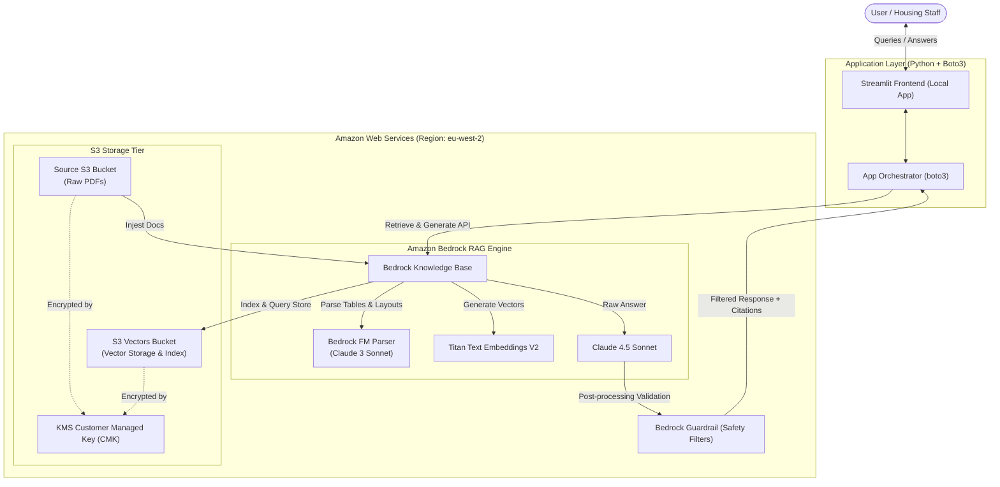

# Architecture & Design: The Brentwood Policy Oracle

This document provides the complete architecture and design specifications for **The Brentwood Policy Oracle**, a serverless Retrieval-Augmented Generation (RAG) system running on AWS. 

It is designed as a secure, high-accuracy, and cost-effective portfolio pilot to query public sector policy documents (specifically, those from the Brentwood Borough Council).

---

## 1. System Architecture

The Brentwood Policy Oracle is built entirely on AWS serverless services to keep operational complexity low and eliminate baseline idle infrastructure costs.

### Architectural Diagram

---

## 2. Design Decisions & Rationale

### A. Serverless S3 Vectors Storage Backend
*   **Decision**: Store vectors in **Amazon S3 Vectors** instead of Amazon OpenSearch Serverless (AOSS).
*   **Rationale**: A standard AOSS collection requires a minimum of 2 OCUs (1 for indexing, 1 for search). In `eu-west-2` (London), this costs roughly **$345/month** even if completely idle. Amazon S3 Vectors stores embeddings directly in a managed S3 bucket, charging purely on S3 storage rates and Bedrock query volume. This reduces the baseline idle cost to **$0.00/month**, perfect for developer portfolios and low-traffic pilots.
*   **Trade-off**: AOSS yields lower latency (tens of milliseconds) for massive-scale concurrent workloads, whereas S3 Vectors yields sub-second query latency (typically 400ms - 900ms) which is fully acceptable for this use case.

### B. Ingest, Parse, and Chunking Design
*   **Foundation Model Parser**: Housing policies contain complex, multi-column eligibility grids and SLA timelines. Standard PDF text parsers scramble columns. We configure the Bedrock Data Source Ingestion job to use the **Foundation Model Parser (powered by Claude 3 Sonnet)** to pre-parse the documents. This extracts the structure, text, and tables into clean Markdown before vectorization.
*   **Hierarchical Chunking (Parent-Child)**:
    *   **Child Chunks**: 200 tokens (with 20% overlap). Used to generate highly targeted vector embeddings to ensure precise semantic matches during search.
    *   **Parent Chunks**: 1,000 tokens. When a child chunk matches a user's search query, the Bedrock Knowledge Base automatically retrieves its larger parent chunk. This provides the LLM with full context (e.g., surrounding text, table headers, legal exemptions) to answer the query accurately.

### C. Foundation Models
*   **Embeddings**: `amazon.titan-embed-text-v2:0` (Titan Text Embeddings V2). Set to **1024 dimensions** for standard accuracy, or **512 dimensions** for maximum cost/storage efficiency.
*   **Generation**: `anthropic.claude-4-5-sonnet-20250929-v1:0` (Claude 4.5 Sonnet). Claude 4.5 Sonnet excels at reasoning, cross-referencing statutory timelines, and interpreting structured Markdown tables.

---

## 3. Security Architecture

AWS Well-Architected security best practices are baked into the core design:
*   **Data Encryption at Rest**: Both the raw PDF data source bucket and the S3 vector bucket are encrypted using an **AWS KMS Customer Managed Key (CMK)** with automatic key rotation enabled. Standard AWS-managed keys (`aws/s3`) are bypassed to enforce explicit resource-level access control.
*   **Least Privilege IAM Access**: IAM roles are scoped to block access to resources outside this project. The Amazon Bedrock Service Role is restricted to read/write only from/to the project-specific S3 buckets.
*   **VPC Private Link Support (Optional)**: If the Streamlit application is hosted in a VPC in the future, all API calls to Amazon Bedrock route through VPC Interface Endpoints (`com.amazonaws.eu-west-2.bedrock-runtime`), preventing data from traversing the public internet.
*   **Amazon Bedrock Guardrails**: A guardrail is applied to filter input prompts for injection, block toxic comments, and enforce the **strict system confidence boundary**: if the query doesn't match retrieved policy chunks, the system defaults to: *"I cannot find this information in the policy documents."*

---

## 4. In-Scope AWS Region

The primary target region for the infrastructure is **`eu-west-2` (London)** to comply with UK public sector data residency patterns. 

*   *Note on Feature Availability*: Amazon Bedrock rolls out features incrementally. If the native S3 Vectors backend configuration experiences regional preview limitations in `eu-west-2` during setup, we will configure the CDK environment to fallback to `us-east-1` (N. Virginia) or `us-west-2` (Oregon) as a secondary staging target.

---

## 5. Development & Deployment Model

*   **Infrastructure as Code (IaC)**: AWS Cloud Development Kit (CDK) in **Python**. Python is chosen as the project's single-language stack for both AI orchestration and infrastructure.
*   **Application Orchestration**: A clean Python Streamlit script using native `boto3` for calls to `client.retrieve_and_generate()` or `client.retrieve()`.
*   **Execution Model**: The Streamlit frontend runs **locally** inside a container or virtual environment, authenticated via AWS IAM Identity Center (SSO) or AWS CLI credentials. The CDK stack will configure IAM permissions to allow this local developer profile access to the Knowledge Base. This eliminates container hosting costs.
*   **Testing and Evaluation**: An offline evaluation script (`eval_pipeline.py`) uses the **Ragas** framework to benchmark the RAG pipeline. It measures **Faithfulness** (no hallucinations), **Answer Relevance**, and **Context Recall** against a curated test dataset of 20 policy questions.

---

## 6. Engineering Discoveries & Operational Advice

During the implementation of Sprint 1, several critical AWS and CDK integration challenges were resolved. Rather than presenting these as errors, we document our final design choices to assist future developers working with Bedrock Knowledge Bases and S3 Vectors:

### A. Foundation Model Parser Selection (Claude 3 Sonnet vs Haiku)
*   **Advice**: We use **Claude 3 Sonnet (`anthropic.claude-3-sonnet-20240229-v1:0`)** for layout-preservation parsing because we cannot use **Claude 3 Haiku** for parsing tasks in this environment (as Haiku has been retired or marked as legacy for Bedrock's foundation model parser service in this region, resulting in deployment/validation failures).

### B. S3 Vectors Metadata Size Limitation (2 KB Limit)
*   **Advice**: We configure the `nonFilterableMetadataKeys` on the S3 Vector Index to explicitly exclude `AMAZON_BEDROCK_TEXT` and `AMAZON_BEDROCK_METADATA` from filter indexing because we cannot use the **default metadata configuration** (which attempts to index all metadata fields, exceeding the strict 2 KB filterable metadata limit per record on Amazon S3 Vectors when using larger 1,000-token parent chunks, causing ingestion jobs to fail with a `400 Bad Request`).

### C. Resolving CDK Cross-Stack Cyclic Dependencies
*   **Advice**: We declare and attach policies to the Bedrock execution role using a separate `iam.Policy` resource instantiated inside the consuming stack (`DataStorageStack`) because we cannot use **`role.add_to_policy()`** across stacks (as the security stack defines the role, and invoking `add_to_policy` from the storage stack causes a CloudFormation cyclic dependency loop: the Security Stack depends on the Storage Stack for S3 bucket details, while the Storage Stack depends on the Security Stack for the KMS key and role).

### D. Overcoming CloudFormation Export Deadlocks During Replacements
*   **Advice**: We temporarily destroy the downstream stack (`BrentwoodKnowledgeBaseStack`) before deploying updates to the storage stack, because we cannot update or replace an **exported resource** (like an S3 Vector Index whose configuration change requires physical replacement) while its ARN is still actively imported by a downstream stack, causing CloudFormation to throw export deadlock errors.

### E. KMS Key Policy Requirements for S3 Vectors Indexing
*   **Advice**: We explicitly add a decryption key policy statement for the `indexing.s3vectors.amazonaws.com` service principal on our KMS Customer Managed Key, because we cannot use a **standard KMS key policy** (which only grants permissions to IAM principals in the account, causing the background S3 Vectors indexer to fail with `Access Denied` when performing asynchronous embedding indexing operations).

### F. Local AWS Environment Authentication
*   **Advice**: We recommend authenticating the local runtime environment using `aws sso login` (IAM Identity Center) or standard access keys because we cannot easily run **local development servers** without an active AWS CLI credential session (as `boto3` requires active IAM credentials to call Bedrock Runtime APIs).
